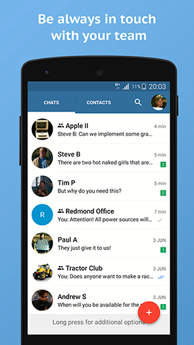
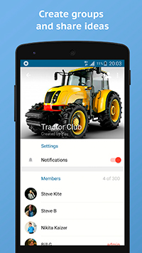
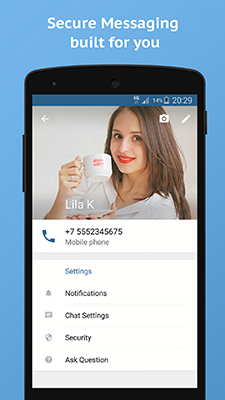

# Actor Messaging platform

 

Actor is a platform for instant messaging. Actor provide features like large group chats; unlimited history storage; send/receive documents, photo, and video; authentication with one time password for phone number/email or OAuth2; easy integrations with external services. Actor has one of the best IM apps for Android, iOS, and Web that built for very bad networks; full offline message and files storage in applications; automatic contact list building; and more...

Actor Platform is good for improving enterprise communications, building a message-oriented startup, building country-wide national messaging. If you interested in something like this you can always ask us by emailing to speed@actor.im.

This repository contains all source code of platform whereby you can start your server or/and build your iOS, Android, Web, or Desktop applications.

# Installation

Building mobile messaging application is a bit complex procedure and you need certain amount of preparations: have developer accounts in Google, Apple, have SSL certificates for your servers, integrate server with various services like SMS gate, push systems, etc... 

For more info, you can read [server installation manual](SERVER.md). After server installation, you can [start building apps](APPS.md).

# Live demo

Keep in touch with Actor community in its [group chat](https://quit.email/join/0d43e6a90d108ad9608514b5c17b76d5b2721d5e2ea51058d6ca43a66befe7f4).

 

# Why Open Source?

It is very hard to find any open source messaging servers that have awesome mobile apps, but if they have they are not so good for everyday use. At some point, we found that the quality of our sources is good enough to share it with a community.

# Contacts

* Group Chat in [Actor Cloud](https://quit.email/join/0d43e6a90d108ad9608514b5c17b76d5b2721d5e2ea51058d6ca43a66befe7f4)
* Twitter: [@actorapp](https://twitter.com/actorapp)
* Email: [speed@actor.im](mailto:speed@actor.im)

# Screenshots
  

# License

Actor Platform released under [MIT License](LICENSE).
